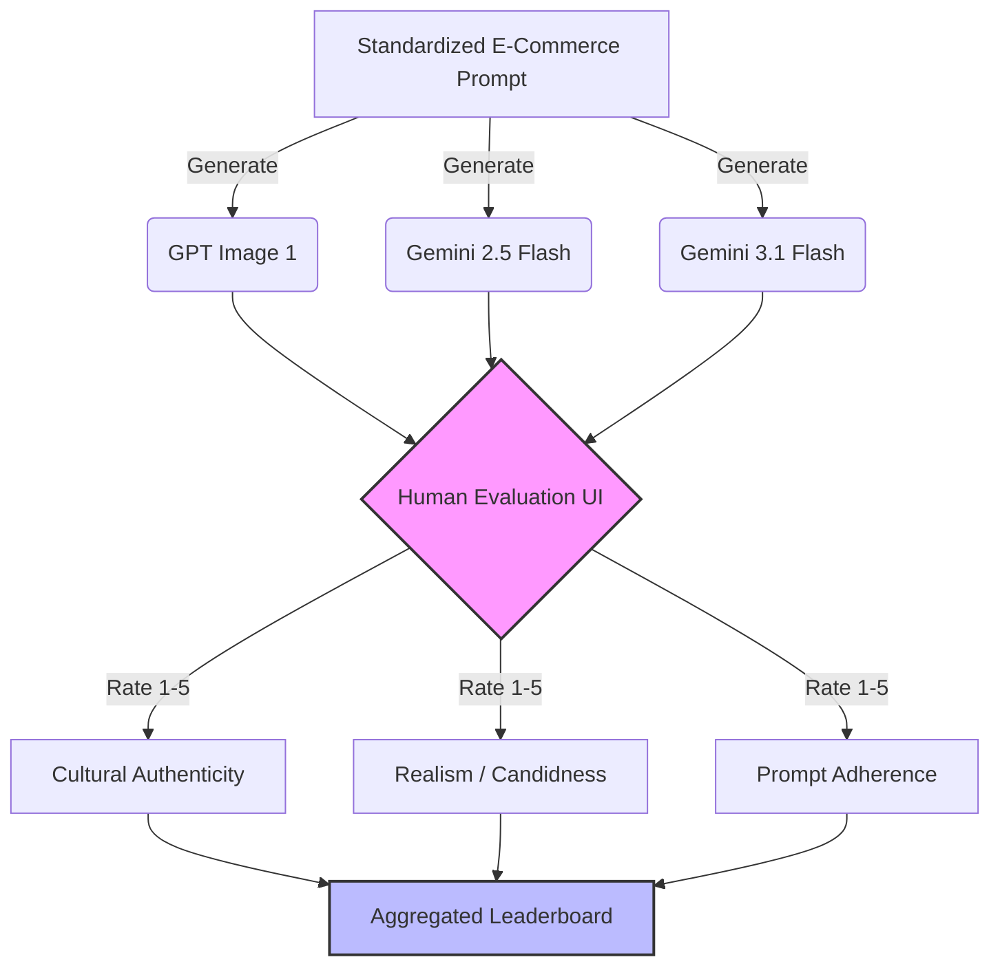

# Bharat-Realism: Text-to-Image Evaluation for Indian E-commerce

## 1. What Eval We Chose
**Evaluation Name:** The "Bharat-Realism" Text-to-Image Eval.
**Category:** E-commerce & Retail Advertising.
**Use Case:** Generating highly realistic, culturally authentic lifestyle product shots of Indian clothing and consumer goods in everyday Indian environments.

## 2. Why We Chose It
Current state-of-the-art image models often default to extreme stereotypes when prompted for "Indian" imagery. They tend to generate either overly glamorous, hyper-saturated Bollywood-style aesthetics, or impoverished rural tropes. In reality, modern Indian e-commerce needs relatable, middle-class, urban and semi-urban settings that look like everyday life (e.g., a local neighborhood market, a regular apartment balcony, a realistic local festival celebration).

## 3. Why It Is Useful for India
India's e-commerce market relies heavily on localized, relatable content. Brands want to generate hyper-local advertisements at scale (e.g., targeting a customer in Pune with a Marathi aesthetic versus a customer in Kolkata with a Bengali aesthetic). If AI models hallucinate cultural markers (e.g., mixing a South Indian wedding garland with a North Indian lehenga, or placing unnatural props in the background), the image loses trust instantly. Evaluating models on their grasp of nuanced "Bharat Realism" is critical for business adoption in India.

## 4. Why It Matters for AI Labs Building for India
An AI lab building for India needs to move beyond superficial representation (just adding brown skin and bright colors) to structural and cultural accuracy. If a model performs well on this eval, it proves that the lab’s training data has successfully captured the long tail of Indian cultural diversity, setting it apart from generic Western models.

## 5. How the Evaluation Works

### Evaluation Pipeline

We selected three foundational models:
1. **OpenAI — GPT Image 1**
2. **Google — Gemini 2.5 Flash Image**
3. **Google — Gemini 3.1 Flash Image Preview**

We generated images using a standardized prompt focused on a specific e-commerce use case.
**The Prompt:** *"A realistic smartphone photo of a 25-year-old Indian man wearing a simple cotton olive green plain Kurta. He is standing casually on the balcony of a middle-class apartment in Mumbai during late evening. The lighting is natural, slightly dim, with warm yellow light coming from inside the house. No hyper-realistic studio lighting, should look like a casual candid e-commerce lifestyle shot."*

**Judging Method:**
10 human participants (aged 18+) rated the outputs blindly (without knowing which model generated which image) on three core metrics (Scale of 1-5):
1. **Cultural Authenticity:** Do the clothing, architecture, and lighting look genuinely Indian?
2. **Realism / Candidness:** Does it look like a real photograph, avoiding the "plastic AI" or overly glamorous look?
3. **Prompt Adherence:** Did it accurately follow the specific details (olive green kurta, balcony, evening lighting)?

## 6. How Participants Judged the Outputs
Participants were shown the images side-by-side on a simple web interface. They evaluated them using a Likert scale for the three metrics and then chose a **Top Preference** (Rank 1). The responses were aggregated to find the average score per metric and the overall win rate for each model.

## 7. Results Found (Sample Run)
*(Based on a sample run with 10 participants)*
- **1st Place — Gemini 3.1 Flash Image Preview:** Emerged as the winner in the "Realism / Candidness" category. Participants noted that the lighting felt authentically like a smartphone photo, and the balcony details (grills, background buildings) felt extremely accurate to an urban Indian setting.
- **2nd Place — Gemini 2.5 Flash Image:** A solid baseline, capturing the cultural aspects well, though occasionally smoothing skin textures too much, reducing the candid feel.
- **3rd Place — OpenAI (GPT Image 1):** Scored high on "Prompt Adherence" but failed heavily on "Realism", with users describing it as "too cartoonish," "hyper-saturated," and "looking like an expensive studio ad rather than a candid shot."

## 8. How to Scale It Further
To scale this evaluation:
1. **Automated LLM-as-a-Judge:** Develop a Vision-Language Model (VLM) judge prompted specifically with a "Cultural Style Guide" (e.g., detailing regional Indian attire rules) to automatically score thousands of images.
2. **Crowdsourcing (via Josh Jobs):** Push micro-tasks to thousands of gig workers across different Indian states. A user from Maharashtra would specifically evaluate the "Marathi authenticity" of an image, ensuring localized ground-truth validation at a massive scale.

---
## Final Reflection
1. **Why did you choose this eval?** I chose it because realism in localization is the biggest barrier to AI adoption in Indian advertising.
2. **Why is it useful for India?** It prevents the homogenization of Indian culture by AI and helps brands create relatable, accurate content.
3. **Why would an AI lab building for India care about it?** It highlights the gap between "good enough for global" and "accurate enough for local," which is their core differentiator.
4. **What did you learn from running the sample?** Models still struggle to unlearn the "studio-lighting" aesthetic. The concept of a "casual smartphone photo" is hard for heavily fine-tuned models to generate without looking polished.
5. **What would you improve with more time?** I would expand the prompt set to cover 10 different regional aesthetics (e.g., a Kerala backwater setting, a Delhi winter market) to test geographical consistency, and build a dedicated web platform for A/B testing outputs.
