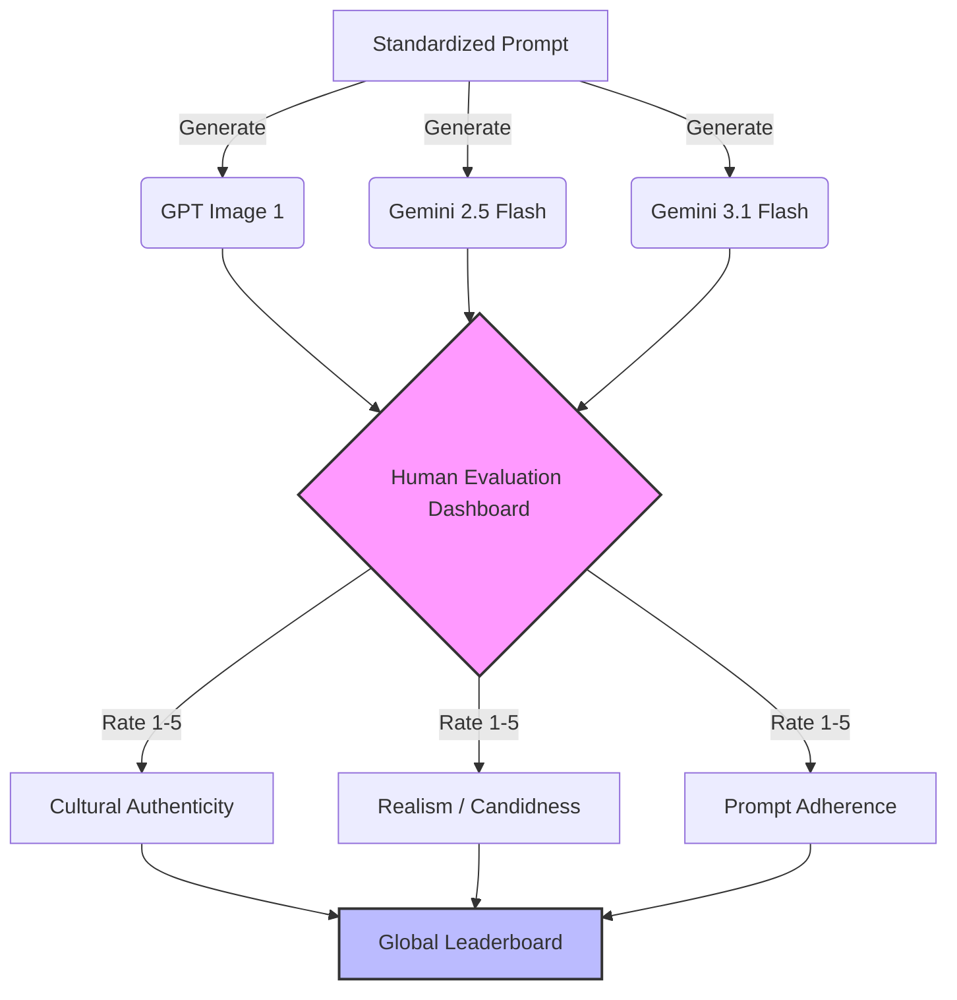
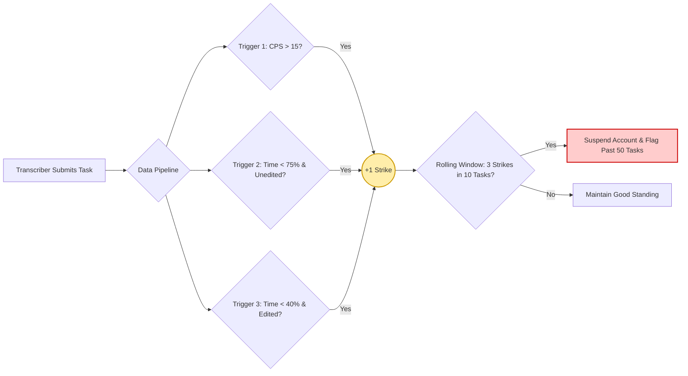

# Josh Talks AI: Product Task Submission 🇮🇳
> An end-to-end evaluation system for Text-to-Image models and Transcriber Quality Assurance.

Welcome to my submission for the Josh Talks AI Product Task (July 2026). This repository contains a fully working suite of reports, UI dashboards, and data analysis pipelines engineered to answer both Question 1 and Question 2.

---

## 📑 Quick Navigation (Deliverables)

### Question 1: Text-to-Image Evaluation
1. 📄 **[Main Document (The "Bharat-Realism" Eval)](Q1_Main_Document.md)** - Full methodology, rationale, and findings.
2. 📄 **[One-Page Executive Summary](Q1_One_Page_Report.md)** - Quick scannable report for busy reviewers.
3. 🛠️ **[Supporting Material](Q1_Supporting_Material.md)** - Prompts used, mock human participant ratings, and consent forms.
4. 💻 **[Interactive UI Dashboard](Dashboard_App.html)** - A fully coded, beautifully styled React/Tailwind frontend. *(Just double-click to open in any browser!)*
5. 🎬 **[Video Walkthrough Script](Q1_Video_Walkthrough_Script.md)** - The script used for the required 2-minute video presentation.
6. 🤖 **[Automated LLM Judge Pipeline](auto_evaluator.py)** - A Python script simulating how to scale this eval using a Vision-Language Model.

### Question 2: Transcriber Quality Analysis
1. 📊 **[Transcriber Analysis & Recommendations](Q2_Transcriber_Analysis.md)** - Analysis of warning signs (Blind Accepts, Bot Copy-Pasting, Impossible Edits).
2. 🐍 **[Rolling Strike System (Python Script)](transcriber_quality.py)** - The backend Python/Pandas logic that automatically flags abusive transcribers.
3. 📈 **Data Samples**: [Input Data](sample_data.csv) | [Audited Output](audited_data.csv)

---

## 🏗️ System Architecture

### Question 1: The "Bharat-Realism" Evaluation Pipeline
The goal of this evaluation is to test if foundational AI image models can generate relatable, unpolished, everyday Indian environments ("Bharat Realism") rather than hyper-glamorous stereotypes.



### Question 2: The Transcriber Quality "Rolling Strike" System
Instead of blocking users for a single mistake, this system uses data patterns to issue strikes, blocking users only when a pattern of abuse is proven.



---

## 🚀 How to Run the Code

**1. The Interactive Rating Dashboard**
No installation required. Simply download or locate `Dashboard_App.html` in this repository and double-click it to open it in Chrome/Safari/Edge. It is a single-file React application.

**2. The Transcriber Quality Script (Python)**
Ensure you have Python and Pandas installed.
```bash
pip install pandas
python transcriber_quality.py
```
This will read the `sample_data.csv`, flag abusive users based on the logic, print a beautiful terminal report, and generate `audited_data.csv`.

**3. The Automated Image Evaluator (Python)**
```bash
python auto_evaluator.py
```
This script simulates passing the generated images to a Vision-Language Model to automate the Bharat-Realism evaluation at scale.
